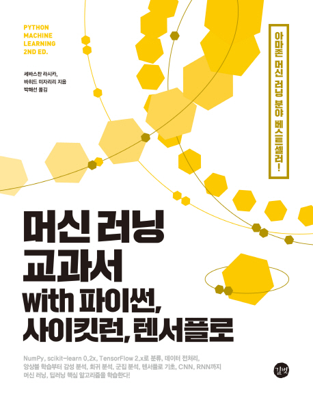

# Python Machine Learning

머신러닝 교과서 with 파이썬, 사이킷런, 텐서플로 공부 및 예제 정리

## Contents

### 1장 컴퓨터는 데이터에서 배운다(생략)

### [2장 간단한 분류 알고리즘 훈련](./ch2)
- 2.1 인공 뉴런 : 초기 머신 러닝의 간단한 역사
- 2.2 파이썬으로 퍼셉트론 학습 알고리즘 구현
- 2.3 적응형 선형 뉴런과 학습의 수렴
